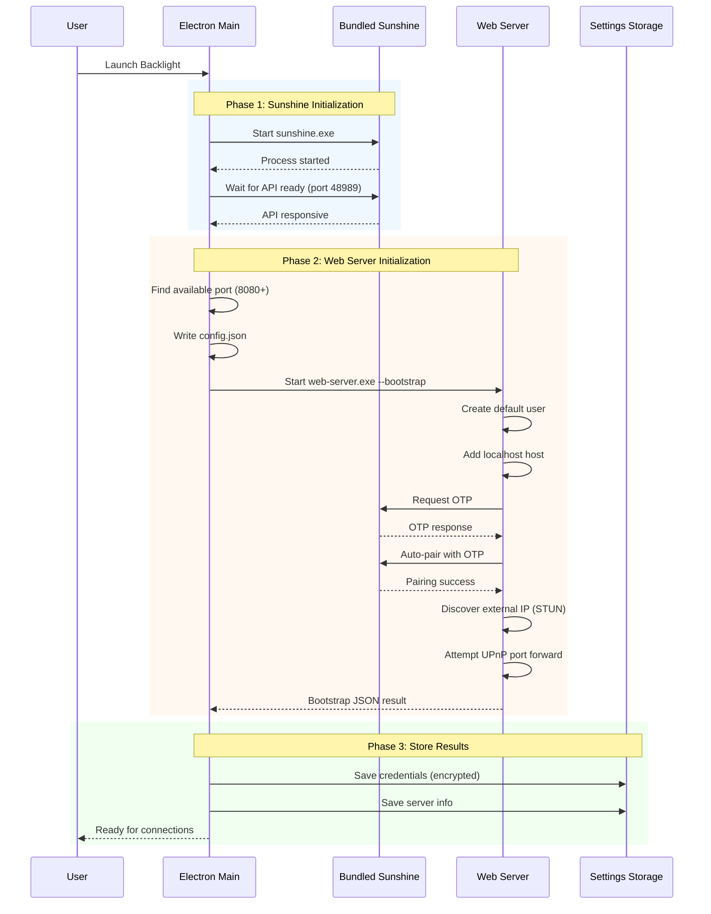
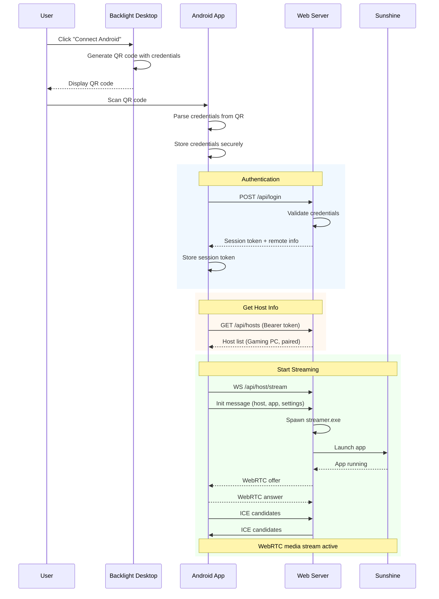
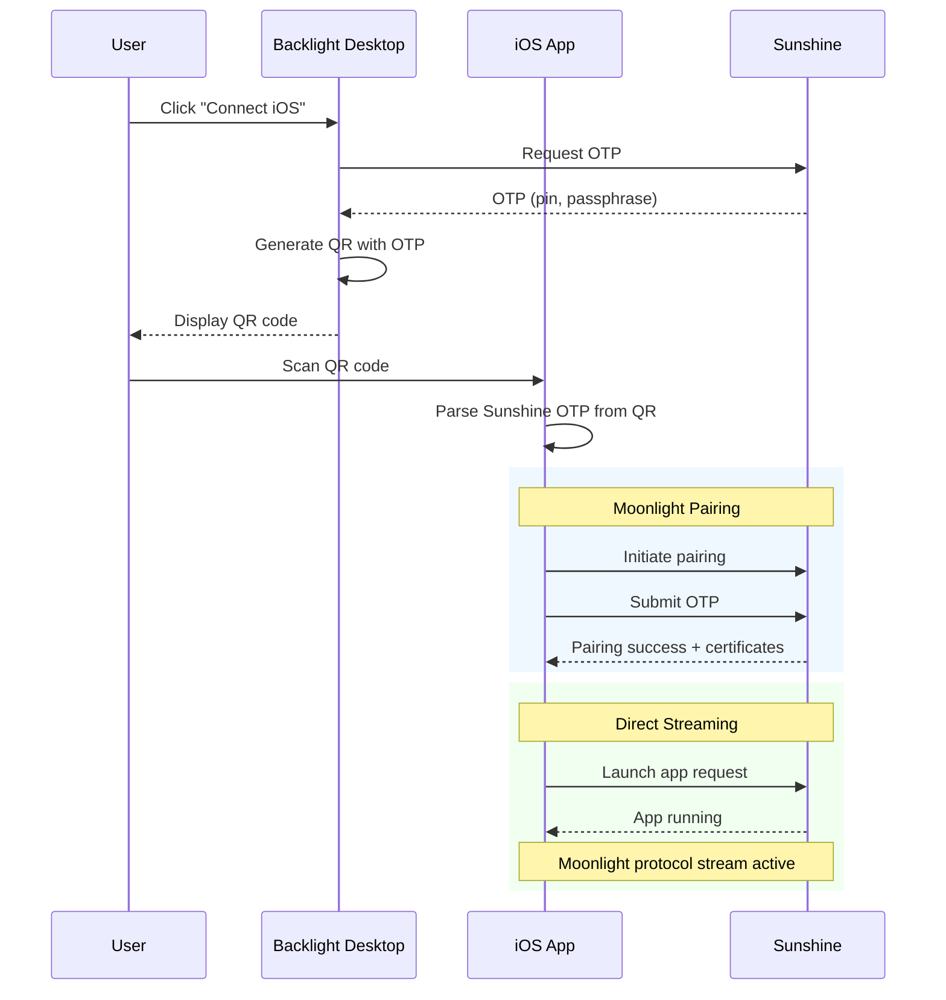
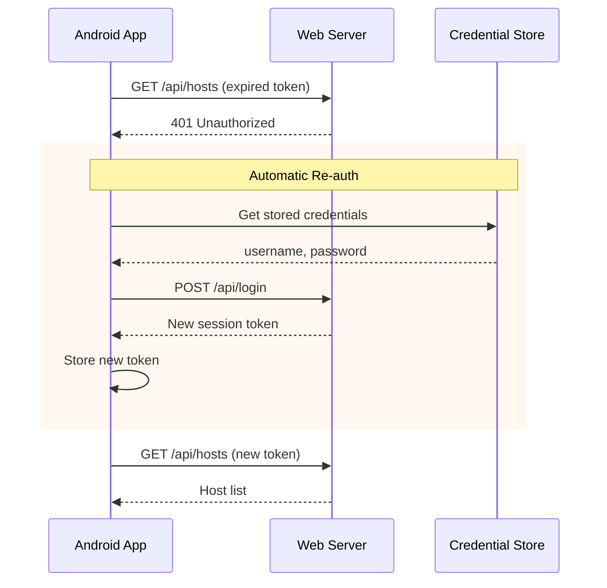
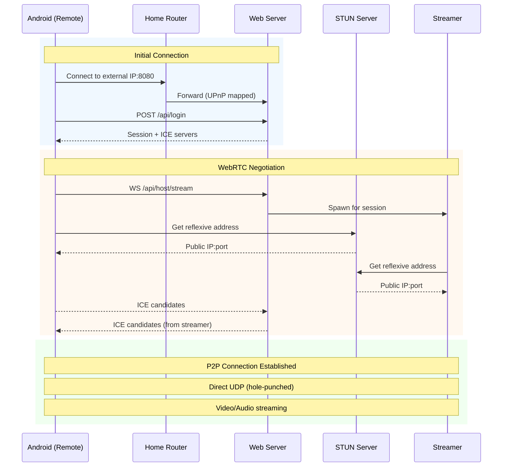
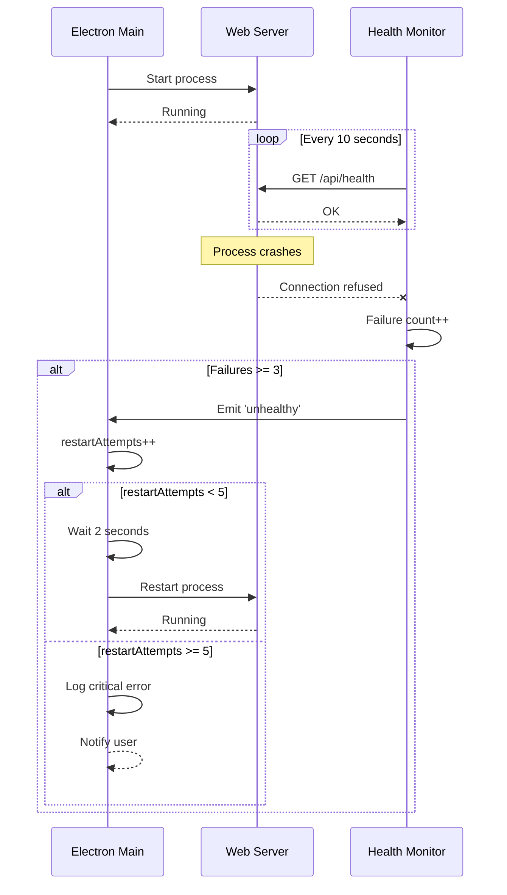
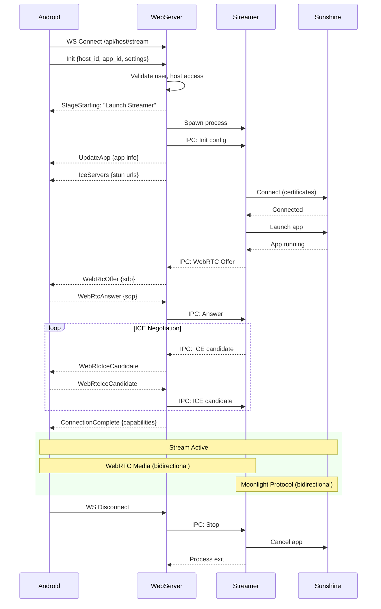

# Backlight Desktop Client
# Web Server Integration Specification

**Version:** 1.0.0  
**Date:** January 16, 2026  
**Status:** Implementation Ready  
**Classification:** Internal Engineering Document

---

<div style="page-break-after: always;"></div>

## Document Information

| Field | Value |
|-------|-------|
| Document Title | Backlight Web Server Integration Specification |
| Version | 1.0.0 |
| Date | January 16, 2026 |
| Author | Engineering Team |
| Status | Implementation Ready |

### Revision History

| Version | Date | Author | Changes |
|---------|------|--------|---------|
| 1.0.0 | 2026-01-16 | Engineering | Initial release |

### Related Documents

| Document | Description |
|----------|-------------|
| FUJI_INTEGRATION.md | Existing Fuji/Backlight OTP integration |
| moonlight-web-stream README | Web streamer project documentation |

---

<div style="page-break-after: always;"></div>

## Table of Contents

1. [Executive Summary](#1-executive-summary)
2. [Architecture Overview](#2-architecture-overview)
3. [Sequence Diagrams](#3-sequence-diagrams)
4. [Component Specifications](#4-component-specifications)
5. [Authentication & Authorization](#5-authentication--authorization)
6. [Dual Platform Support](#6-dual-platform-support)
7. [Remote Streaming](#7-remote-streaming)
8. [API Reference](#8-api-reference)
9. [Implementation Guide](#9-implementation-guide)
10. [Testing & Troubleshooting](#10-testing--troubleshooting)

---

<div style="page-break-after: always;"></div>

## 1. Executive Summary

### 1.1 Objective

Embed the moonlight-web-stream server and streamer components into the Backlight desktop client to provide:

- **Seamless WebRTC streaming** for Android clients via the Backbone mobile app
- **Continued Moonlight protocol support** for iOS clients via the custom Moonlight fork
- **Zero-configuration setup** for end users
- **Remote streaming capability** via WebRTC with STUN/UPnP

### 1.2 Key Outcomes

| Outcome | Description |
|---------|-------------|
| **Single Installation** | Users install only Backlight; web server is invisible |
| **Auto-Pairing** | Web server automatically pairs with embedded Sunshine |
| **Dual Platform** | Android (WebRTC) and iOS (Moonlight) both supported |
| **Remote Access** | Internet streaming via UPnP/STUN where network allows |
| **Credential Obfuscation** | Users never interact with web server directly |

### 1.3 Scope

**In Scope:**
- Embedding web-server.exe and streamer.exe in Backlight
- Auto-configuration on first launch
- Dual QR code generation (Android/iOS)
- Remote streaming via STUN/UPnP
- Android client authentication flow

**Out of Scope (Current Version):**
- TURN server relay (infrastructure preserved for future)
- Multi-host management (single embedded Sunshine only)
- Web browser streaming UI (mobile clients only)

---

<div style="page-break-after: always;"></div>

## 2. Architecture Overview

### 2.1 High-Level System Architecture

```
┌─────────────────────────────────────────────────────────────────────────────────┐
│                        BACKLIGHT DESKTOP CLIENT                                  │
│                           (Single Installation)                                  │
├─────────────────────────────────────────────────────────────────────────────────┤
│                                                                                  │
│  ┌──────────────────┐    ┌──────────────────┐    ┌──────────────────────┐       │
│  │  Electron Main   │    │  Web Server      │    │  Bundled Sunshine    │       │
│  │  Process         │    │  (web-server.exe)│    │  (sunshine.exe)      │       │
│  │                  │    │                  │    │                      │       │
│  │  • Process mgmt  │───►│  • User/session  │◄──►│  • OTP endpoint      │       │
│  │  • QR generation │    │  • Host pairing  │    │  • Video encoding    │       │
│  │  • Settings UI   │    │  • WebRTC signal │    │  • Moonlight proto   │       │
│  └──────────────────┘    └────────┬─────────┘    └──────────────────────┘       │
│                                   │                                              │
│                    ┌──────────────▼──────────────┐                              │
│                    │  Streamer (streamer.exe)    │  Spawned per stream          │
│                    │  • WebRTC media transport   │  by web-server               │
│                    │  • Protocol translation     │                              │
│                    └─────────────────────────────┘                              │
│                                                                                  │
└─────────────────────────────────────────────────────────────────────────────────┘
                    │                                        │
                    │ WebRTC (Android)                       │ Moonlight (iOS)
                    ▼                                        ▼
         ┌─────────────────────┐                 ┌─────────────────────┐
         │  Android Client     │                 │  iOS Client         │
         │  (Backbone App)     │                 │  (Moonlight Fork)   │
         └─────────────────────┘                 └─────────────────────┘
```

### 2.2 Network Architecture

```
┌─────────────────────────────────────────────────────────────────────────────────┐
│                              HOME NETWORK                                        │
├─────────────────────────────────────────────────────────────────────────────────┤
│                                                                                  │
│   ┌─────────────────────────────────────────────────────────────┐               │
│   │                    BACKLIGHT PC                              │               │
│   │                                                              │               │
│   │  ┌────────────────┐  ┌────────────────┐  ┌──────────────┐   │               │
│   │  │ Web Server     │  │ Sunshine       │  │ Streamer     │   │               │
│   │  │ :8080 (HTTP)   │  │ :48989 (HTTP)  │  │ (dynamic)    │   │               │
│   │  │                │  │ :48990 (HTTPS) │  │              │   │               │
│   │  └────────────────┘  └────────────────┘  └──────────────┘   │               │
│   │         │                    │                   │          │               │
│   │         └────────────────────┼───────────────────┘          │               │
│   │                              │                               │               │
│   └──────────────────────────────┼───────────────────────────────┘               │
│                                  │                                               │
│                           ┌──────▼──────┐                                       │
│                           │   Router    │                                       │
│                           │   (UPnP)    │                                       │
│                           └──────┬──────┘                                       │
│                                  │                                               │
└──────────────────────────────────┼───────────────────────────────────────────────┘
                                   │
                            ┌──────▼──────┐
                            │  Internet   │
                            └──────┬──────┘
                                   │
              ┌────────────────────┼────────────────────┐
              │                    │                    │
     ┌────────▼────────┐  ┌───────▼────────┐  ┌───────▼────────┐
     │ Mobile (Local)  │  │ Mobile (Remote)│  │ STUN Servers   │
     │ Same WiFi       │  │ 4G/5G/Other    │  │ (Google, etc)  │
     └─────────────────┘  └────────────────┘  └────────────────┘
```

### 2.3 Port Allocation

| Component | Port | Protocol | Purpose |
|-----------|------|----------|---------|
| Web Server | 8080 (configurable) | HTTP/WS | API, WebSocket signaling |
| Sunshine HTTP | 48989 | HTTP | Sunshine API, pairing |
| Sunshine HTTPS | 48990 | HTTPS | Secure API, streaming setup |
| Sunshine Stream | 47998-48000 | UDP | Moonlight game stream |
| Backlight WebSocket | 47995 | WS | iOS device communication |
| WebRTC Media | 40000-40100 | UDP | WebRTC audio/video |

---

<div style="page-break-after: always;"></div>

## 3. Sequence Diagrams

### 3.1 Application Startup Sequence



### 3.2 Android QR Code Pairing Flow



### 3.3 iOS QR Code Pairing Flow (Existing)



### 3.4 Session Expiry and Re-authentication



### 3.5 Remote Streaming Connection



### 3.6 Web Server Crash Recovery



### 3.7 Streaming Session Lifecycle



---

<div style="page-break-after: always;"></div>

## 4. Component Specifications

### 4.1 Web Server (web-server.exe)

**Source:** `moonlight-web-stream/moonlight-web/web-server/`

**Responsibilities:**
- HTTP API for mobile client communication
- WebSocket server for real-time signaling
- User authentication and session management
- Host (Sunshine) pairing and management
- Spawning streamer subprocesses for active streams

**Configuration (config.json):**

```json
{
  "data_storage": {
    "type": "json",
    "path": "./data.json"
  },
  "web_server": {
    "bind_address": "0.0.0.0:8080",
    "session_cookie_expiration": { "secs": 86400, "nanos": 0 }
  },
  "moonlight": {
    "default_http_port": 48989,
    "pair_device_name": "Backlight-WebServer"
  },
  "webrtc": {
    "ice_servers": [
      { "urls": ["stun:stun.l.google.com:19302"] }
    ],
    "port_range": { "min": 40000, "max": 40100 }
  },
  "upnp": {
    "enabled": true,
    "lease_duration_secs": 3600
  },
  "remote": {
    "enabled": true,
    "stun_discovery": true
  },
  "streamer_path": "./streamer.exe"
}
```

**Command Line Arguments:**

| Argument | Description | Default |
|----------|-------------|---------|
| `--config <PATH>` | Config file path | ./server/config.json |
| `--bind <ADDR:PORT>` | Override bind address | From config |
| `--bootstrap` | Enable auto-setup mode | Disabled |
| `--bootstrap-user <NAME>` | Auto-create user | "backlight" |
| `--bootstrap-password <PW>` | User password | Auto-generated UUID |
| `--bootstrap-host <ADDR>` | Host to auto-add | "localhost" |
| `--bootstrap-host-port <PORT>` | Host HTTP port | 48989 |

### 4.2 Streamer (streamer.exe)

**Source:** `moonlight-web-stream/moonlight-web/streamer/`

**Responsibilities:**
- WebRTC peer connection management
- Receiving video/audio from Sunshine via Moonlight protocol
- Transcoding/forwarding media over WebRTC
- Input handling (keyboard, mouse, gamepad)

**Invocation:** Automatically spawned by web-server.exe per streaming session. Communicates via stdin/stdout JSON IPC.

### 4.3 File System Layout

```
Backlight/
├── Backlight.exe
├── resources/
│   ├── sunshine/                    # Existing
│   │   ├── sunshine.exe
│   │   └── config/
│   └── moonlight-web/               # NEW
│       ├── web-server.exe
│       ├── streamer.exe
│       └── static/
└── %APPDATA%/Backlight/
    ├── sunshine-bundle/             # Existing
    ├── moonlight-web/               # NEW
    │   ├── config.json
    │   ├── data.json
    │   └── logs/
    └── settings.json
```

---

<div style="page-break-after: always;"></div>

## 5. Authentication & Authorization

### 5.1 Authentication Model

The embedded web server uses a simplified single-user model:

| Aspect | Configuration |
|--------|---------------|
| Users | Single auto-created user ("backlight") |
| Password | Auto-generated UUID, stored encrypted |
| Sessions | Token-based, 24-hour expiration |
| Distribution | Credentials included in QR code |

### 5.2 Credential Flow

```
┌─────────────────────────────────────────────────────────────────┐
│                    CREDENTIAL LIFECYCLE                          │
├─────────────────────────────────────────────────────────────────┤
│                                                                  │
│  1. GENERATION (First Launch)                                    │
│     └── Web server generates UUID password                       │
│     └── Bootstrap outputs: { user: { password: "uuid..." } }     │
│                                                                  │
│  2. STORAGE (Desktop)                                            │
│     └── Electron stores in settings.json                         │
│     └── Encrypted with Electron safeStorage                      │
│                                                                  │
│  3. DISTRIBUTION (QR Code)                                       │
│     └── Credentials embedded in Android QR code JSON             │
│     └── User scans QR, app extracts credentials                  │
│                                                                  │
│  4. MOBILE STORAGE                                               │
│     └── Android: Encrypted with Android Keystore                 │
│     └── Used for automatic re-authentication                     │
│                                                                  │
│  5. SERVER STORAGE                                               │
│     └── Password hashed with Argon2 in data.json                 │
│     └── Original password never stored on server                 │
│                                                                  │
└─────────────────────────────────────────────────────────────────┘
```

### 5.3 Session Management

| Event | Behavior |
|-------|----------|
| Login success | Return session token (JWT-like) |
| Token expires | 401 response, client re-authenticates |
| Server restart | Sessions invalidated, clients re-auth |
| Logout | Token blacklisted |

---

<div style="page-break-after: always;"></div>

## 6. Dual Platform Support

### 6.1 Platform Comparison

| Aspect | Android | iOS |
|--------|---------|-----|
| **Protocol** | WebRTC | Moonlight (native) |
| **Server** | moonlight-web-stream | Direct to Sunshine |
| **Auth Method** | Username/password + session | OTP pairing |
| **QR Code Type** | `backlight-webserver` | `fuji-pairing` |
| **Latency** | +5-15ms (WebRTC overhead) | Optimal |
| **Remote Support** | Built-in (STUN/UPnP) | Requires port forward |

### 6.2 QR Code Schemas

**Android QR Code:**
```json
{
  "type": "backlight-webserver",
  "version": 1,
  "server": {
    "localUrl": "http://192.168.1.100:8080",
    "remoteUrl": "http://73.45.123.89:8080",
    "remoteAvailable": true
  },
  "credentials": {
    "username": "backlight",
    "password": "a3f8c2d1-b4e5-..."
  },
  "host": {
    "id": 1,
    "name": "Gaming PC"
  }
}
```

**iOS QR Code:**
```json
{
  "type": "fuji-pairing",
  "sessionId": "session_17054...",
  "ipAddress": "192.168.1.100",
  "port": 47995,
  "sunshineOTP": {
    "pin": "1234",
    "passphrase": "desktop_17054...",
    "expiresAt": 1705432400000,
    "urls": {
      "http": "http://192.168.1.100:48989",
      "https": "https://192.168.1.100:48990"
    }
  }
}
```

### 6.3 UI Design

```
┌─────────────────────────────────────────────────────────┐
│                   Connect Mobile Device                  │
├─────────────────────────────────────────────────────────┤
│                                                          │
│   ┌─────────────────┐     ┌─────────────────┐           │
│   │    Android      │     │      iOS        │           │
│   │   [Selected]    │     │                 │           │
│   └─────────────────┘     └─────────────────┘           │
│                                                          │
│   ┌─────────────────────────────────────────────┐       │
│   │                                             │       │
│   │              ████████████████              │       │
│   │              ██            ██              │       │
│   │              ██  QR CODE   ██              │       │
│   │              ██            ██              │       │
│   │              ████████████████              │       │
│   │                                             │       │
│   └─────────────────────────────────────────────┘       │
│                                                          │
│   ✓ Remote access available                              │
│     External IP: 73.45.123.89                           │
│                                                          │
│   Scan this QR code with the Backbone app               │
│                                                          │
└─────────────────────────────────────────────────────────┘
```

---

<div style="page-break-after: always;"></div>

## 7. Remote Streaming

### 7.1 NAT Traversal Strategy

| NAT Type | % Users | Direct P2P | UPnP | Manual Forward |
|----------|---------|------------|------|----------------|
| Full Cone | ~20% | ✅ | ✅ | ✅ |
| Restricted Cone | ~30% | ✅ | ✅ | ✅ |
| Port Restricted | ~25% | ⚠️ | ✅ | ✅ |
| Symmetric | ~15% | ❌ | ❌ | ❌* |
| CGNAT | ~10% | ❌ | ❌ | ❌ |

*Symmetric NAT cannot be traversed without TURN relay

### 7.2 Connection Strategy

```
1. Try direct P2P (STUN-assisted)
   └── Works for ~75% of users
   
2. If direct fails, check UPnP
   └── Auto-forward ports if router supports
   
3. If UPnP unavailable
   └── Show user guidance for manual port forward
   
4. If Symmetric NAT / CGNAT detected
   └── Suggest VPN solution (Tailscale, ZeroTier)
   └── TURN relay (future feature)
```

### 7.3 User Guidance Messages

| Condition | Message |
|-----------|---------|
| Remote available | "✓ Remote access ready - connect from anywhere" |
| UPnP failed | "Manual setup required - forward port {port} on your router" |
| Symmetric NAT | "Limited remote access - try Tailscale VPN for best results" |
| CGNAT | "Remote unavailable - contact ISP for public IP or use VPN" |

### 7.4 TURN Server (Future)

Infrastructure is preserved but disabled:

```json
{
  "turn": {
    "enabled": false,
    "urls": [],
    "username": "",
    "credential": ""
  }
}
```

When enabled, add TURN server URLs to ICE configuration for users behind restrictive NATs.

---

<div style="page-break-after: always;"></div>

## 8. API Reference

### 8.1 Authentication Endpoints

#### POST /api/login

Authenticate and receive session token.

**Request:**
```json
{
  "name": "backlight",
  "password": "a3f8c2d1-b4e5-..."
}
```

**Response (200):**
```json
{
  "session_token": "eyJ...",
  "remote_access": {
    "external_ip": "73.45.123.89",
    "port": 8080,
    "nat_type": "restricted_cone",
    "turn_recommended": false,
    "ice_servers": [{"urls": ["stun:stun.l.google.com:19302"]}]
  }
}
```

#### GET /api/authenticate

Validate session and get remote info.

**Headers:** `Authorization: Bearer <token>`

**Response (200):**
```json
{
  "remote_access": { ... }
}
```

### 8.2 Host Endpoints

#### GET /api/hosts

List all hosts (streaming NDJSON).

**Response (line 1):**
```json
{"hosts":[{"host_id":1,"name":"Gaming PC","paired":"Paired","server_state":null}]}
```

**Response (line 2+):**
```json
{"host_id":1,"name":"Gaming PC","paired":"Paired","server_state":"Free"}
```

#### GET /api/host?host_id=1

Get detailed host information.

**Response:**
```json
{
  "host": {
    "host_id": 1,
    "name": "Gaming PC",
    "paired": "Paired",
    "server_state": "Free",
    "host_type": "Backlight",
    "address": "localhost",
    "http_port": 48989,
    "https_port": 48990
  }
}
```

### 8.3 Application Endpoints

#### GET /api/apps?host_id=1

List available applications.

**Response:**
```json
{
  "apps": [
    {"app_id": 1, "title": "Desktop", "is_hdr_supported": false},
    {"app_id": 2, "title": "Cyberpunk 2077", "is_hdr_supported": true}
  ]
}
```

### 8.4 Streaming Endpoint

#### WS /api/host/stream

WebSocket endpoint for streaming session.

**Client → Server (Init):**
```json
{
  "Init": {
    "host_id": 1,
    "app_id": 2,
    "bitrate": 20000,
    "fps": 60,
    "width": 1920,
    "height": 1080,
    "video_supported_formats": 7
  }
}
```

**Server → Client (Flow):**
1. `{"StageStarting": {"stage": "Launch Streamer"}}`
2. `{"UpdateApp": {"app": {...}}}`
3. `{"IceServers": {"ice_servers": [...]}}`
4. `{"WebRtcOffer": {"sdp": "..."}}`
5. `{"ConnectionComplete": {"capabilities": {...}}}`

### 8.5 Health Endpoint

#### GET /api/health

No authentication required.

**Response:**
```json
{
  "status": "ok",
  "version": "1.0.0",
  "uptime_secs": 3600,
  "active_streams": 0,
  "hosts": {"total": 1, "paired": 1, "online": 1},
  "remote_access": {
    "upnp_enabled": true,
    "upnp_success": true,
    "external_ip": "73.45.123.89",
    "nat_type": "restricted_cone"
  }
}
```

### 8.6 Error Codes

| Code | HTTP Status | Description |
|------|-------------|-------------|
| `InvalidCredentials` | 401 | Wrong username/password |
| `SessionTokenNotFound` | 401 | Session expired |
| `Forbidden` | 403 | No permission |
| `HostNotFound` | 404 | Invalid host ID |
| `HostNotPaired` | 400 | Host not paired |
| `HostOffline` | 504 | Host unreachable |

---

<div style="page-break-after: always;"></div>

## 9. Implementation Guide

### 9.1 Implementation Phases

| Phase | Duration | Deliverable |
|-------|----------|-------------|
| **1. Core Embedding** | Week 1-2 | Web server runs as Backlight subprocess |
| **2. Auto-Configuration** | Week 2-3 | Zero-config first launch |
| **3. Dual QR Code UI** | Week 3-4 | Android and iOS pairing flows |
| **4. Android Updates** | Week 4-5 | Mobile app fully functional |
| **5. Testing & Polish** | Week 5-6 | Production ready |

### 9.2 Phase 1: Core Embedding Tasks

**Backend Team:**
- [ ] Verify Windows build: `cross build --release --target x86_64-pc-windows-gnu`
- [ ] Test standalone web-server.exe operation
- [ ] Document Windows dependencies

**Desktop Team:**
- [ ] Add `resources/moonlight-web/` directory
- [ ] Create `WebServerManager` class
- [ ] Implement process spawn/kill lifecycle
- [ ] Implement crash recovery (max 5 restarts)
- [ ] Add dynamic port selection
- [ ] Add Windows Firewall rule

### 9.3 Phase 2: Auto-Configuration Tasks

**Backend Team:**
- [ ] Implement `--bootstrap` CLI flag
- [ ] Auto-create user on first launch
- [ ] Auto-add localhost host
- [ ] Auto-pair with Sunshine via OTP
- [ ] Output bootstrap JSON to stdout
- [ ] Implement `/api/health` endpoint

**Desktop Team:**
- [ ] Parse bootstrap JSON from stdout
- [ ] Store credentials with safeStorage
- [ ] Implement health check polling

### 9.4 Phase 3: Dual QR Code UI Tasks

**Desktop Team:**
- [ ] Add "Connect Android" tab/button
- [ ] Generate Android QR code with credentials
- [ ] Display remote access status
- [ ] Show user guidance for NAT issues

### 9.5 Phase 4: Android Client Tasks

**Android Team:**
- [ ] Parse `backlight-webserver` QR schema
- [ ] Implement credential storage (Keystore)
- [ ] Implement login flow
- [ ] Implement auto-reconnect on 401
- [ ] Update streaming to use web server

### 9.6 Key Code: WebServerManager

```typescript
// src/main/lib/moonlight-web/WebServerManager.ts

export class WebServerManager extends EventEmitter {
  private process: ChildProcess | null = null;
  private restartAttempts = 0;
  
  async initialize(): Promise<BootstrapResult> {
    await this.ensureDirectories();
    const port = await this.findAvailablePort();
    await this.writeConfig(port);
    await this.setupFirewall(port);
    return await this.start();
  }
  
  async start(): Promise<BootstrapResult> {
    const args = [
      '--config', this.configPath,
      '--bind', `0.0.0.0:${this.port}`,
      '--bootstrap',
      '--bootstrap-user', 'backlight'
    ];
    
    this.process = spawn(this.executablePath, args, {
      cwd: this.bundleDir,
      stdio: ['ignore', 'pipe', 'pipe']
    });
    
    // Capture bootstrap JSON from stdout
    return this.waitForBootstrap();
  }
  
  async stop(): Promise<void> {
    this.process?.kill('SIGTERM');
    await this.waitForExit(5000);
    this.process?.kill('SIGKILL');
  }
}
```

---

<div style="page-break-after: always;"></div>

## 10. Testing & Troubleshooting

### 10.1 Test Matrix

| Scenario | Steps | Expected Result |
|----------|-------|-----------------|
| First launch | Start Backlight fresh | User created, host paired |
| Android local | Same network, scan QR | Stream < 20ms latency |
| Android remote | Different network, UPnP | Connection established |
| Session expiry | Wait 24h, make request | Auto re-login |
| Crash recovery | Kill web-server.exe | Restart within 5s |
| iOS pairing | Scan iOS QR | Direct Moonlight works |

### 10.2 NAT Traversal Tests

| NAT Type | Test Environment | Expected |
|----------|-----------------|----------|
| Full Cone | Home router, UPnP on | Direct P2P |
| Restricted | Office, UPnP blocked | Manual forward needed |
| Symmetric | Mobile hotspot | Show guidance |
| CGNAT | Carrier network | Show guidance |

### 10.3 Troubleshooting Guide

#### Web Server Won't Start

**Checks:**
1. Port 8080 in use? `netstat -ano | findstr :8080`
2. Executable exists in resources?
3. Firewall blocking?
4. Check logs: `%APPDATA%/Backlight/moonlight-web/logs/`

**Resolution:** Kill conflicting process, add firewall rule, check logs

#### Auto-Pairing Fails

**Checks:**
1. Sunshine running? Check port 48989
2. OTP endpoint accessible?
3. Credentials match (username:password)?

**Resolution:** Restart Sunshine, check Sunshine logs

#### Android Can't Connect

**Checks:**
1. Same network? Try local URL
2. Different network? Check UPnP status
3. NAT type in bootstrap result?

**Resolution:** Enable UPnP, configure port forward, use VPN

#### High Latency

**Checks:**
1. Network bandwidth (need 20+ Mbps)
2. Using 5GHz WiFi?
3. Other bandwidth-heavy apps?

**Resolution:** Reduce bitrate, switch to 5GHz, close other apps

---

<div style="page-break-after: always;"></div>

## Appendix A: Type Definitions

```typescript
// Bootstrap Result
interface BootstrapResult {
  success: boolean;
  user?: { id: number; username: string; password: string };
  host?: { id: number; name: string; paired: boolean };
  server?: { 
    port: number; 
    external_ip: string | null;
    upnp_success: boolean;
    nat_type: string;
  };
  error?: string;
}

// QR Code Schemas
interface AndroidQRCode {
  type: "backlight-webserver";
  version: number;
  server: {
    localUrl: string;
    remoteUrl: string | null;
    remoteAvailable: boolean;
  };
  credentials: { username: string; password: string };
  host: { id: number; name: string };
}

interface IOSQRCode {
  type: "fuji-pairing";
  sessionId: string;
  ipAddress: string;
  port: number;
  sunshineOTP: {
    pin: string;
    passphrase: string;
    expiresAt: number;
    urls: { http: string; https: string };
  };
}

// API Types
interface LoginResponse {
  session_token: string;
  remote_access: RemoteAccessInfo | null;
}

interface RemoteAccessInfo {
  external_ip: string | null;
  port: number;
  nat_type: string;
  turn_recommended: boolean;
  ice_servers: RtcIceServer[];
}

interface Host {
  host_id: number;
  name: string;
  paired: "Paired" | "NotPaired";
  server_state: "Free" | "Busy" | null;
  host_type?: "Backlight" | "Standard";
}

interface App {
  app_id: number;
  title: string;
  is_hdr_supported: boolean;
}
```

---

<div style="page-break-after: always;"></div>

## Appendix B: Configuration Templates

### Web Server config.json

```json
{
  "data_storage": {
    "type": "json",
    "path": "./data.json",
    "session_expiration_check_interval": {"secs": 300, "nanos": 0}
  },
  "web_server": {
    "bind_address": "0.0.0.0:8080",
    "first_login_create_admin": false,
    "session_cookie_expiration": {"secs": 86400, "nanos": 0}
  },
  "moonlight": {
    "default_http_port": 48989,
    "pair_device_name": "Backlight-WebServer"
  },
  "webrtc": {
    "ice_servers": [
      {
        "is_default": true,
        "urls": [
          "stun:stun.l.google.com:19302",
          "stun:stun1.l.google.com:3478",
          "stun:stun.cloudflare.com:3478"
        ]
      }
    ],
    "port_range": {"min": 40000, "max": 40100},
    "network_types": ["udp4", "udp6"]
  },
  "upnp": {
    "enabled": true,
    "lease_duration_secs": 3600,
    "description": "Backlight Web Streaming"
  },
  "remote": {
    "enabled": true,
    "stun_discovery": true
  },
  "turn": {
    "enabled": false,
    "urls": [],
    "username": "",
    "credential": ""
  },
  "streamer_path": "./streamer.exe",
  "log": {
    "level_filter": "Info",
    "file_path": "./logs/web-server.log"
  }
}
```

---

## Document End

**Total Pages:** ~25  
**Last Updated:** January 16, 2026  
**Next Review:** Upon implementation completion
